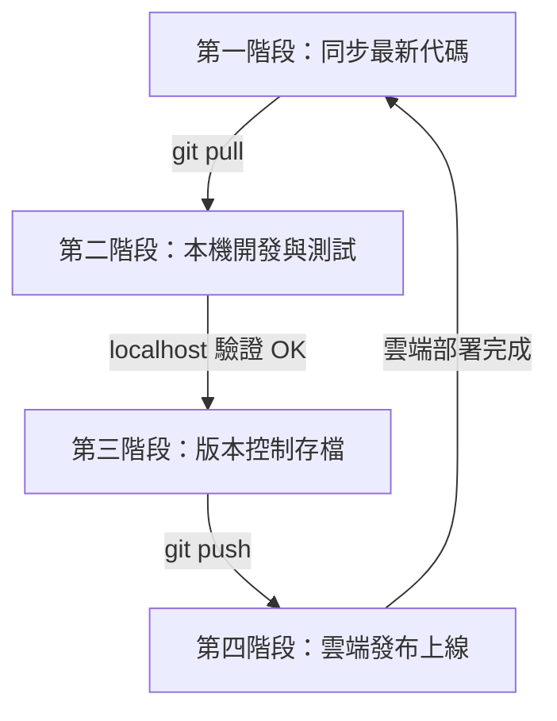

# 專案開發與發布工作流程規範 (Standard Development & Deployment Workflow)

本文件定義了專案的標準開發、測試、版控與部署發布流程。旨在確保程式碼的穩定性、版本的一致性，並防範未經測試的程式碼被意外發布至生產環境。

---

## 核心原則 (Core Principles)
* **先本機，後雲端**：任何修改必須先在本機測試無誤後，才能發布。
* **先存檔，後發布**：發布前必須先將程式碼提交（Commit）並推送（Push）至遠端 Git 儲存庫。
* **單一事實來源**：Git 儲存庫是專案的唯一真實版本標準。

---

## 🔄 開發發布四部曲 (The Four Phases)



### 第一階段：開始開發前 —— 同步代碼
在開始撰寫任何代碼、修復錯誤或加入新功能之前，必須先從遠端儲存庫拉取最新版程式碼。
* **執行動作**：同步最新的遠端分支。
* **參考指令**：
  ```bash
  git pull
  ```
* **目的**：避免因本機與遠端代碼版本不一致，導致後續合併時產生程式碼衝突 (Conflict)。

### 第二階段：本機開發與測試 —— 本地驗證
在本機環境進行程式碼修改，並利用本地開發伺服器進行即時測試。
* **執行動作**：
  1. 啟動本機開發伺服器 (Local Dev Server)。
  2. 在瀏覽器打開 `localhost` 本地網址。
  3. 模擬實際使用情境，對修改過的功能進行全面性測試。
  4. 執行本地編譯打包測試 (Build Check)，確保沒有任何編譯錯誤。
* **目的**：確保任何程式碼修改在進入生產環境前，皆已在本機通過功能與語法驗證。

### 第三階段：版本控制 —— 提交存檔
本地測試確認 100% 正常無誤後，必須先將修改提交並備份到 Git 儲存庫中。
* **執行動作**：
  1. 檢視修改的檔案狀態。
  2. 將修改的檔案加入暫存區。
  3. 寫下清晰明確的提交訊息 (Commit Message) 進行本地提交。
  4. 推送至遠端的託管平台 (如 GitHub / GitLab)。
* **參考指令**：
  ```bash
  git add .
  git commit -m "feat/fix: 簡短描述本次修改內容"
  git push
  ```
* **目的**：
  * **程式碼備份**：確保修改成果已上傳至雲端版控，防止電腦故障導致代碼遺失。
  * **安全保險金**：在發布前做好版本記號，若後續部署失敗，能快速且安全地回滾到這一個穩定版本。

### 第四階段：雲端發布上線 —— 正式部署
當程式碼已成功備份至 Git 儲存庫後，執行發布指令將編譯後的成果部署至雲端託管平台（如 Firebase Hosting / Google Cloud / AWS / Vercel）。
* **執行動作**：
  1. 執行雲端部署指令。
  2. 在正式的雲端網址上進行最後的線上功能確認。
* **目的**：正式將最新的穩定成果更新上線，提供給終端用戶使用。
