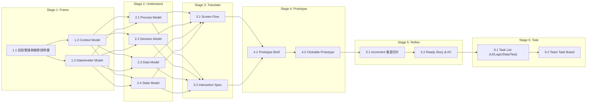

# AI-ARM (AI 輔助需求建模與敏捷 Refinement) 課程設計與交付物協作工作檔

> **文件定位**：本工作檔為「AI-ARM 課程內容、教材 Prompt、互動工具與實作流程」的共同討論與逐步完備基石。
> **貫穿主軸**：從模糊訪談 ➔ 結構化需求建模 ➔ 介面規格 ➔ Clickable Prototype ➔ INVEST 垂直切片 ➔ Ready Increment & Tasks。
> **單一貫穿案例**：企業差旅申請與費用報支系統。

---

## 🗺️ 總覽：AI-ARM 交付鏈與六大階段地圖

---

## 📋 每一交付物的三大討論維度定義

在完善每一個交付物模組時，我們將聚焦討論以下三個問題：
1. **打算教什麼 (Teaching Focus & AI Concepts)**：
   * 核心概念與思維模型（如：為什麼要建此模型？痛點是什麼？）。
   * AI 協作角色與 Prompt 提示工程技巧（如何引導 AI 生成高質量結構化輸出？）。
   * 防呆、防幻覺與邊界檢查原則。
2. **怎麼讓學員動手和互動 (Hands-on & Interactive Mechanics)**：
   * 小組分工與演練設計（小組怎麼討論？角色如何扮演？）。
   * 平台工具使用（Prompt Hub、決策表工具、狀態轉換矩陣、即時共享看板）。
   * 互相對齊、Cross-Review 與盲點揭露。
3. **交付物定義與前後串接 (Upstream Input ➔ Artifact ➔ Downstream Dependency)**：
   * **前置依據 (Input)**：承接上游哪一個交付物？
   * **交付物標準格式 (Deliverable Format)**：表格、Mermaid 圖表、Markdown 規格、可點擊原型等。
   * **後續依據 (Output to Next)**：為下游哪一個交付物提供不可或缺的依據？

---

# 階段與交付物詳細討論清單

---

## 階段 1：Frame (範圍與角色框定)
> **階段目標**：從口語模糊的原始訪談中萃取核心價值，框定系統邊界與利害關係人，建立團隊共同語言。

### 【工作檔 1.1】訪談逐字稿整理與專案願景說明書 (Vision & Envisioning Statement)
* **打算教什麼**：
  * 語音辨識原始逐字稿的常見缺陷（口語、同音錯字、角色混雜、無標點）。
  * 敏捷願景六大維度：目標用戶 (Users)、用戶痛點 (Needs)、範圍定位 (Scope)、核心功能 (Features)、獨特區隔 (Discriminator)、成效指標 (Measurements)。
  * 如何用 Prompt 引導 AI 忠於原意整理，避免 AI 自行發明未提及的業務功能。
* **怎麼讓學員動手和互動**：
  * 學員複製平台提供的「訪談逐字稿整理 Prompt」與「願景制定 Prompt」。
  * 輸入真實雜亂的訪談逐字稿，觀察 AI 整理前後差異。
  * 小組討論並修正 AI 產出的 6 大維度，並將願景說明書發布至「小組共享看板」進行全班對照。
* **交付物定義與前後串接**：
  * **上游輸入**：原始口語訪談錄音/逐字稿（差旅報支訪談）。
  * **本交付物**：結構化《專案願景說明書》（Markdown 格式）。
  * **下游串接**：作為 1.2 Context Model（邊界範圍）與 1.3 Stakeholder Model（角色清單）的基礎輸入。

---

### 【工作檔 1.2】Context Model (系統邊界與外部整合模型)
* **打算教什麼**：
  * 什麼是系統邊界（In-scope vs. Out-of-scope），避免需求蔓延。
  * 識別核心系統與外部系統/第三方服務（如：ERP、人事差勤系統、銀行撥款 API、OCR 發票辨識）。
  * Mermaid Context Diagram 語法與資料流向表示法。
* **怎麼讓學員動手和互動**：
  * 透過 Context Model Prompt，將願景說明書轉換為系統邊界圖。
  * 小組演練：「哪些功能是本系統做？哪些是呼叫外部系統？」（例如：匯率轉換是內建還是介接外部 API？）。
* **交付物定義與前後串接**：
  * **上游輸入**：工作檔 1.1《專案願景說明書》之 Scope 與 Features。
  * **本交付物**：Context Model 圖表（Mermaid / 邊界對照表）。
  * **下游串接**：為 Stage 2 Process Model（確認跨系統泳道）與 Data Model（外部整合欄位）提供範圍依據。

---

### 【工作檔 1.3】Stakeholder Model (角色與權限矩陣)
* **打算教什麼**：
  * 利害關係人分類：主要使用者、審批者、系統管理員、稽核與財務。
  * 角色權限矩陣（RACI / Role-Action Matrix）。
  * 如何防止遺漏關鍵隱性角色（如代理人、稽核人員）。
* **怎麼讓學員動手和互動**：
  * 利用 AI 根據訪談與願景萃取所有角色與責任。
  * 小組角色認領與審批鏈規則檢驗。
* **交付物定義與前後串接**：
  * **上游輸入**：工作檔 1.1 之 Users 與 Scope。
  * **本交付物**：角色清單與權限對照矩陣。
  * **下游串接**：為 Stage 2 Process Model（各步驟負責人/泳道）及 Stage 3 Screen Flow（不同角色的操作頁面）提供權限依據。

---

## 階段 2：Understand (需求建模 / 4 大核心模型)
> **階段目標**：將模糊業務邏輯轉化為精確的結構化模型（流程、規則、資料、狀態），消除歧義與邏輯漏洞。

### 【工作檔 2.1】Process Model (流程模型 / 業務旅程與工作流)
* **打算教什麼**：
  * 端到端流程主幹（Happy Path）與例外分支（Alternative / Exception Paths）。
  * 使用者任務（User Tasks）與系統自動化任務（System Tasks）的區分。
  * Event Storming / Mermaid Flowchart 的結構化表達。
* **怎麼讓學員動手和互動**：
  * 透過 Event Stormer 線上白板或 Prompt，梳理出差旅「事前申請 ➔ 出差執行 ➔ 報銷提交 ➔ 主管簽核 ➔ 財務審查 ➔ 撥款結案」完整事件流。
  * 小組抓出「退件」、「補件」、「超額」等例外路徑。
* **交付物定義與前後串接**：
  * **上游輸入**：1.2 Context Model（跨系統邊界）+ 1.3 Stakeholder Model（執行角色）。
  * **本交付物**：Process Flowchart（Mermaid）與任務清單。
  * **下游串接**：驅動 2.2 決策節點、2.4 狀態轉換點，並作為 Stage 3 Screen Flow（畫面切換順序）的骨幹。

---

### 【工作檔 2.2】Decision Model (決策模型 / 決策表 Decision Table)
* **打算教什麼**：
  * 多條件（自變數）與多動作（應變數）的邏輯組合。
  * 決策表解耦原則：如何穷舉所有情境、消除衝突規則、使用無關標記（Don't Care `-`）進行規則化簡。
  * 差旅案例：國內/國外、職級（一般/主管）、是否超額（超額 <20% / >20%）、單據是否齊全 ➔ 核決權限（直屬主管/部門主管/總經理/退件）。
* **怎麼讓學員動手和互動**：
  * 使用平台內建的「Decision Table 協作工具」，實際勾選條件與動作。
  * 練習三層次挑戰：Level 1 填空 ➔ Level 2 找 Bug（邏輯衝突/遺漏）➔ Level 3 複雜業務規則建模。
* **交付物定義與前後串接**：
  * **上游輸入**：2.1 Process Model 中的條件分支節點。
  * **本交付物**：標準化 Decision Table（Markdown / 矩陣資料結構）。
  * **下游串接**：為 Stage 3 Interaction Spec 提供後端驗證邏輯，為 Stage 5 Refinement 提供「Decision 切片法」依據。

---

### 【工作檔 2.3】Data Model (資料模型 / 欄位規格與資料字典)
* **打算教什麼**：
  * 核心實體（Entity）與屬性（Attributes）：出差申請單、費用報銷單、費用明細項目、發票憑證。
  * 欄位型別、必填/選填、計算公式、格式驗證規則（如統編 8 碼、金額 > 0）。
  * 實體關係（1:1, 1:N 如一張報銷單有多筆費用明細）。
* **怎麼讓學員動手和互動**：
  * AI 提示詞從流程與訪談自動生成初步「資料字典草稿」。
  * 小組檢驗欄位完整性，標記哪些欄位由使用者輸入、哪些由系統自動計算（如：小計、稅額、里程補貼換算）。
* **交付物定義與前後串接**：
  * **上游輸入**：2.1 流程表單與 2.2 決策計算變數。
  * **本交付物**：結構化資料字典（Data Dictionary Table）。
  * **下游串接**：作為 Stage 3 Interaction Spec 的欄位控制項、Stage 4 Prototype 的表單 Input、Stage 6 Task 的 Data/DB 任務。

---

### 【工作檔 2.4】State Model (狀態模型 / 狀態轉換矩陣 STM)
* **打算教什麼**：
  * 實體的生命週期：草稿 (Draft) ➔ 審批中 (Pending) ➔ 已核准 (Approved) ➔ 已退回 (Rejected) ➔ 待撥款 (Ready to Pay) ➔ 已結案 (Closed) ➔ 已作廢 (Voided)。
  * 狀態轉換矩陣（Status Transition Matrix）：橫軸「目前狀態」、縱軸「目標狀態」，交叉點填入「觸發事件/前置條件 (Guard Condition)」。
  * 防禦性建模：識別無效遷移（如：已結案不能再退回）、死循環與孤立狀態。
* **怎麼讓學員動手和互動**：
  * 使用平台「Status Transition Matrix 協作工具」。
  * 小組進行狀態合法性標記（允許/禁止/條件允許），並驗證逆向流程（如撤回、重送）。
* **交付物定義與前後串接**：
  * **上游輸入**：2.1 流程節點之事件觸發。
  * **本交付物**：Status Transition Matrix + State Machine Diagram。
  * **下游串接**：直接作為 Stage 3 按鈕可見/可用狀態控制、Stage 5 User Story 的狀態驗收條件 (AC)。

---

## 階段 3：Translate (規格轉譯)
> **階段目標**：將 4 大抽象模型轉譯為具體的介面導航（Screen Flow）與互動行為（Interaction Spec），作為 Prototype 生成與開發規格的橋樑。

### 【工作檔 3.1】Screen Flow (畫面流動圖 / 畫面導航)
* **打算教什麼**：
  * 從 Process Model 到頁面拓撲結構的映射（列表頁 ➔ 表單填寫頁 ➔ 明細預覽頁 ➔ 審批簽核頁 ➔ 成功反饋頁）。
  * 跨角色頁面路徑與權限路由。
  * 彈窗 (Modal)、抽屜 (Drawer) 與全頁跳轉的決策依據。
* **怎麼讓學員動手和互動**：
  * 小組利用 Mermaid 繪製系統 Screen Flow。
  * 將各組負責的子模組畫面串接，在平台上組成完整的系統頁面地圖。
* **交付物定義與前後串接**：
  * **上游輸入**：1.3 角色 + 2.1 流程 + 2.4 狀態。
  * **本交付物**：Screen Flow Diagram（頁面流轉圖）。
  * **下游串接**：直接定義 Stage 4 Prototype 的頁面路由與導航結構。

---

### 【工作檔 3.2】Interaction Specification (互動規格書)
* **打算教什麼**：
  * 頁面元素互動規格：按鈕點擊、表單即時驗證、錯誤提示、Loading 狀態、禁用 (Disabled) 條件。
  * 如何將 2.2 決策規則轉為前端 UI 反饋（例如：當金額超過 10,000 時，動態顯示「需加會處長」提示）。
  * 如何將 2.4 狀態轉為按鈕顯示控制（例如：只有「審批中」且「當前審批人」才能看到「核准/駁回」按鈕）。
* **怎麼讓學員動手和互動**：
  * 填寫標準化的互動規格表（欄位名稱、控制項型態、初始值、動態行為、錯誤訊息）。
  * 小組 Cross-Review 彼此的互動邏輯是否周延。
* **交付物定義與前後串接**：
  * **上游輸入**：2.2 決策表 + 2.3 資料字典 + 2.4 狀態矩陣 + 3.1 畫面流。
  * **本交付物**：結構化 UI 互動規格書（Interaction Spec Markdown）。
  * **下游串接**：作為 Stage 4 AI Vibe Coding 的精確 Prompt 輸入，確保生成的 Prototype 具備真實業務邏輯。

---

## 階段 4：Prototype (原型驗證)
> **階段目標**：利用 AI（Vibe Coding）快速生成可點擊、可互動的真實原型，在進入開發前直觀驗證需求與流程。

### 【工作檔 4.1】Prototype Brief (原型設定與約束規格)
* **打算教什麼**：
  * 什麼是 Prototype Brief：定義原型目標、演示情境、包含的畫面範圍與省略的非核心細節。
  * 提示工程：如何把 Screen Flow + Interaction Spec + Data Dictionary 組合成餵給 AI 的高成效 Prototype Generation Prompt。
* **怎麼讓學員動手和互動**：
  * 學員使用「Prototype Brief 範本」，定義各自小組負責畫面的原型範圍與假資料 (Mock Data)。
* **交付物定義與前後串接**：
  * **上游輸入**：3.1 Screen Flow + 3.2 Interaction Spec。
  * **本交付物**：Prototype Brief 提示詞包。
  * **下游串接**：輸入至 AI 工具生成 4.2 Clickable Prototype。

---

### 【工作檔 4.2】Clickable Prototype (AI 輔助交互原型)
* **打算教什麼**：
  * AI Vibe Coding 技巧：如何使用 Claude / ChatGPT / Cursor 等工具，一鍵生成 HTML+Tailwind+JS 的可操作原型。
  * 原型驗證思維：透過點擊操作，檢查「流程順不順、規則對不對、狀態漏不漏」。
  * 區分「原型驗證需求」與「正式系統開發」的本質差異。
* **怎麼讓學員動手和互動**：
  * 各組使用 AI 生成可點擊的原型網頁。
  * **Prototype 連結分享牆**：各組將原型發布至平台，全班跨組試玩並給予體驗反饋（找出哪裡卡住、哪條規則沒生效）。
* **交付物定義與前後串接**：
  * **上游輸入**：4.1 Prototype Brief + 3.2 規格。
  * **本交付物**：Clickable Prototype（可操作網頁連結或 HTML 代碼）。
  * **下游串接**：確認需求無誤後，作為 Stage 5 Agile Refinement 的拆解切片依據。

---

## 階段 5：Refine (敏捷需求精煉 / Increment 拆分)
> **階段目標**：原型通常涵蓋多個能力，透過 Refinement 將龐大需求垂直切片為一個 Sprint 內可完成、具備商業價值的 Ready Increments。

### 【工作檔 5.1】Increment 垂直切片拆分 (SPLIT 拆分手法)
* **打算教什麼**：
  * 為什麼不能水平切（只做 UI 或只做 DB 不是 Increment！）。
  * 四大垂直切片策略：
    1. **A&B 切片 (Workflow / Path Slicing)**：先做主要快樂路徑 (A)，後做例外/退件路徑 (B)。
    2. **Decision 切片 (Rule Slicing)**：先做單一固定費率/單一主管簽核，後做階層式審批規則。
    3. **Discount 切片 (Simplification Slicing)**：先做手動輸入報銷，後做 OCR 智慧發票辨識。
    4. **Dependency 切片 (Integration Slicing)**：先用 Mock 資料庫/本機存儲，後接 ERP/銀行 API。
* **怎麼讓學員動手和互動**：
  * 對照 4.2 Clickable Prototype 與 2.1 流程圖，小組演練「如何切出 Sprint 1、Sprint 2 的 MVP 增量」。
  * 在看板上標記不同切片顏色的功能範圍。
* **交付物定義與前後串接**：
  * **上游輸入**：4.2 Clickable Prototype + 2.1 流程 + 2.2 決策。
  * **本交付物**：Increment Slicing Roadmap（增量切片地圖）。
  * **下游串接**：為 5.2 產出個別 Ready User Story 提供範圍界定。

---

### 【工作檔 5.2】Ready User Story & 驗收準則 (Acceptance Criteria, AC)
* **打算教什麼**：
  * 符合 **INVEST** 原則（Independent, Negotiable, Valuable, Estimable, Small, Testable）。
  * User Story 標準句型：`作為 [角色]，我想要 [功能/行動]，以便於 [商業價值]`。
  * 結構化 AC 撰寫法：Given-When-Then (BDD 格式) 或 Rule-based AC，嚴密呼應 2.2 決策與 2.4 狀態。
  * Definition of Ready (DoR) 檢核清單。
* **怎麼讓學員動手和互動**：
  * 使用 AI 輔助從切片生成 User Story 與 AC 草稿。
  * 小組進行 INVEST 嚴格審查與評分（例如：這個 Story 可以在 3 天內測完嗎？）。
  * 發布至「Ready Story 協同清單」。
* **交付物定義與前後串接**：
  * **上游輸入**：5.1 Increment 垂直切片 + 2.2 決策表 + 2.4 狀態矩陣。
  * **本交付物**：Ready Product Backlog Item (PBI) 與 AC 清單。
  * **下游串接**：作為 Stage 6 團隊開發任務拆解的唯一承接單位。

---

## 階段 6：Task (團隊任務拆解與落地)
> **階段目標**：由跨職能團隊將一個 Ready User Story 拆解為可協作執行的具體工作任務，確保開發與測試時序順暢。

### 【工作檔 6.1】Task List (技術與協作任務拆解)
* **打算教什麼**：
  * 四大任務維度拆解法：
    * **UI 任務**：前端元件開發、頁面佈局、表單防呆。
    * **Logic 任務**：後端商業邏輯、決策規則計算、狀態遷移控制。
    * **Data 任務**：資料表 Schema 建立、API 接口設計、資料遷移/Mock。
    * **Test 任務**：單元測試、E2E 流程測試、AC 驗收測試案例。
  * 任務估算與顆粒度控制（建議 0.5 天 ~ 2 天/任務）。
* **怎麼讓學員動手和互動**：
  * 小組扮演跨職能團隊（前端、後端、QA、BA），共同拆解指定 User Story 的 Task List。
  * 標記任務間的相依性 (Dependency) 與並行開發可能性。
* **交付物定義與前後串接**：
  * **上游輸入**：5.2 Ready User Story & AC。
  * **本交付物**：結構化 Task List（含工作量與技術維度）。
  * **下游串接**：注入 6.2 Team Task Board 進行 Sprint 執行管理。

---

### 【工作檔 6.2】Team Task Board (團隊協作看板與時序)
* **打算教什麼**：
  * 視覺化看板管理：To Do ➔ In Progress ➔ Testing ➔ Done。
  * 限制在製品 (WIP Limit) 與團隊每日站會 (Daily Scrum) 協作節奏。
  * 追溯性鏈條檢視：從 Task ➔ Story ➔ Prototype ➔ Model ➔ Vision 完整閉環。
* **怎麼讓學員動手和互動**：
  * 在平台內建的即時同步 Task Board 上進行卡片拖拽與分配。
  * 模擬 Sprint 開發過程中的狀態更新與障礙排除 (Blocker Resolution)。
* **交付物定義與前後串接**：
  * **上游輸入**：6.1 Task List。
  * **本交付物**：即時動態 Task Board 與燃盡/進度追蹤。
  * **下游串接**：完成需求交付閉環，進入 Sprint Review 與 Retrospective。

---

## 🚀 後續完備工作推進路徑建議

我們可以依照以下節奏逐一深入完備每一個工作檔：
1. **第一步（當前）**：確認整體框架與工作檔結構是否符合您的教學設計哲學。
2. **第二步**：依序針對每個工作檔，深入討論並撰寫：
   * 專屬的 **AI Prompt 範本**（精準且可直接複製）。
   * 貫穿案例（差旅系統）的 **標準示範內容 (Golden Sample)**。
   * 學員操作流程與 **Web 協作工具介面組件**。
