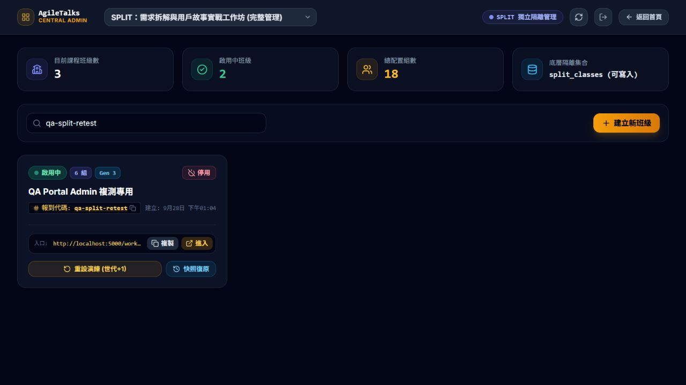

# 中央後台修復第二輪複測回覆

- 日期：2026-09-28，約 13:24～13:27（Asia/Taipei）。
- 對應 DEV 文件：`../dev-responses/DEV_FIX_RESPONSE_PORTAL_ADMIN_20260928.md`。
- 結論：**本輪 5 項：3 PASS、2 FAIL；仍不可全數結案。** 三項原待修缺陷中兩項通過、一項仍失敗；另發現一項學員密碼驗證問題。
- 本期管理範圍維持 AI-ARM、SPLIT；AI-Align、HOOK、棉花糖管理功能不納入。只核對其 Portal inactive 標記，未要求補做管理功能。
- 本次沒有修改產品程式、部署規則、git pull／push，亦未重啟監聽。

## 1. 判定摘要

| 項目 | 結果 | QA 實測 |
|---|---|---|
| BUG-PORTAL-RETEST-02 機密／管理授權 | **FAIL（P0 未結案）** | 管理密碼遮罩、錯誤密碼提示、正確登入及登出均正常；但未附身分憑證的 REST 仍回傳 HTTP 200 與機密文件欄位，非 DEV 宣告的 403。新版本機規則亦仍允許無條件寫入。 |
| BUG-PORTAL-RETEST-03 跨班 session | **PASS（指定主要路徑）** | 原有舊班 session 的 localhost 瀏覽器進入 qa-split-retest，正確出現新班門禁；報到後重新整理仍保留正確姓名。再換 qa-split-test-01 會顯示該班門禁；回 qa-split-retest 恢復 QA-Fix-Alice，沒有沿用另一班姓名。 |
| BUG-PORTAL-RETEST-04 重設原因 | **PASS** | 測試班 Gen 2→3；自訂原因同時存在班級 `lastResetReason` 與稽核紀錄 `reason`，文字一致。 |
| Portal active／inactive 標記 | **PASS** | SPLIT、AI-ARM 為 Active 管理入口；AI-Align、棉花糖、HOOKED 為 Inactive，保留教材／教具次級入口，Portal 未提供其管理入口。 |
| BUG-PORTAL-RETEST-05 學員密碼未驗證 | **FAIL（新發現，P1）** | 專用測試班輸入明確錯誤密碼仍成功進入；來源設定 `passwordEnabled: false`，門禁也沒有驗證後台儲存的班級專屬密碼。 |

這是本輪五項重點檢查的統計，不是重新執行前輪所有 13 個案例。原始報告與證據保留。BUG-PORTAL-RETEST-01 仍為範圍外／暫緩。

## 2. 版本與證據可信範圍

- HEAD 仍為 `be97fafd8a5564b8ee13b4ce6a7077d4358a7001`，含未提交變更；不能把本次結果當成乾淨 commit 驗收。
- 實際測試 `http://localhost:5000/workshop/` 的新版產物。Portal、admin、SPLIT adapter 的 served hash 與來源相同；SPLIT HTML 與 dist 相同，引用 `index-C2n8gCyp.js`。
- QA 實跑 `node tests/verify-suite.js`：12/12、exit 0。仍是 mock／本機邏輯測試：例如群組 4 以正則和數值判斷模擬權限，**沒有對實際 Firestore Security Rules 執行拒絕斷言**，因此其 PASS 不能證明雲端存取已封鎖。
- 本輪沒有另跑 build-all；核對並測試 DEV 已提供的本機建置，沒有自行部署任何修復。
- 證據：[版本與未授權讀取結果](../evidence/portal-admin-fix2-20260928/version-security.json)、[套件輸出](../evidence/portal-admin-fix2-20260928/suite.txt)、[工作目錄狀態](../evidence/portal-admin-fix2-20260928/git-status.txt)。

## 3. P0 仍失敗：UI 門禁不能代替後端授權

### 已通過的部分

1. 開啟中央後台出現管理員驗證遮罩。
2. 輸入錯誤測試密碼，出現「密碼錯誤，請重新輸入」。
3. 使用交接文件指定的管理密碼，進入後台並可操作測試班。
4. 點擊「登出管理員權限」，遮罩再次出現。

證據：[登入後](../evidence/portal-admin-fix2-20260928/admin-login.txt)、[登出後](../evidence/portal-admin-fix2-20260928/admin-logout.txt)。未測每一個管理操作的所有繞過路徑。

### 實際未解決的部分

對本輪專用班級，發出未帶 Authorization 的 GET：

`https://firestore.googleapis.com/v1/projects/marshmallow-agile-3b4b/databases/(default)/documents/split_class_secrets/qa-split-retest`

實測 **HTTP 200**，回傳欄位包含 `studentPasscode`、`adminPasswordHash`、`classId`、`updatedAt`。證據僅保存欄位名稱，不保存秘密值。網路工具最初受 sandbox 限制，經正常審核允許唯讀請求後取得此結果，並非將連線失敗誤判為規則阻擋。

本機 `firestore.rules` 雖新增 `allow read: if false`，但該檔修改並不等於連線中的雲端已採用。此次現況直接不符合「未驗證讀取一律 403」的宣告；QA 未部署規則，也未推斷實際規則部署歷程。

此外，本機新規則對 `split_class_secrets`、`split_classes` 等仍有 `allow write: if true`。因此即使部署這份規則，文字本身仍未要求寫入者具備管理身分。這是靜態審查發現；QA 沒有用未授權 PATCH 篡改任何班級或憑證來示範。

**DEV 修復驗收要求：**管理權限應有後端可驗證身分及規則約束；請提供實際規則生效環境，驗證未登入／學員讀取機密與執行管理寫入均遭拒絕、管理者正常操作。不能僅用 sessionStorage 布林值與前端密碼遮罩結案。

## 4. 跨班身分主要路徑通過

使用保留先前測試 session 的同一個 localhost 瀏覽器：

1. 開啟 `?c=qa-split-retest`，顯示門禁，代碼為 qa-split-retest，未直接出現先前 qa-split-2026 的身分。
2. 姓名 QA-Fix-Alice、第 1 組報到；重整後仍為該姓名。
3. 導向 `?c=qa-split-test-01`，顯示另一班報到畫面。
4. 以另一姓名進入後，再導回 `?c=qa-split-retest`，恢復 QA-Fix-Alice，班級專屬身分未混用。

證據：[新班門禁](../evidence/portal-admin-fix2-20260928/new-class-gate.txt)、[再次換班門禁](../evidence/portal-admin-fix2-20260928/cross-class-gate.txt)、[恢復原班](../evidence/portal-admin-fix2-20260928/session-restored.txt)。

PASS 限完整頁面導航／重整及本輪身分回填；未驗證所有 history API 動態換網址、竄改儲存資料、過期 session 或角色撤權情境。密碼驗證另列新缺陷，不與換班行為合併宣告通過。

## 5. 重設原因持久化通過

僅操作 `qa-split-retest`：

1. 篩選該班並開啟「重設演練 (世代+1)」。
2. 原世代為 2；彈窗預設原因「進入第 3 回合演練」。
3. 改填「QA 20260928 複測：確認自訂重設原因持久化」並確認一次。
4. UI 顯示 Gen 3；REST 核對班级文件 `currentGeneration=3`、`lastResetReason` 為上述文字，稽核事件 `fromGeneration=2`、`toGeneration=3`、`reason` 同字串。

證據：[完成 DOM](../evidence/portal-admin-fix2-20260928/reset-complete.txt)、[雲端文件／稽核](../evidence/portal-admin-fix2-20260928/reset-cloud.json)。稽核文件未見 DEV 文字所宣告的 `clientRequestId`，此點不影響原缺陷「原因持久化」通過，但請 DEV 校正交接說明或補齊實作。

測試班最後為 active、6 組、Gen 3。保留歷史世代，未清空或重設其他班。另一專用班 qa-split-test-01 僅作登入檢查，沒有編輯其筆記。

## 6. 新缺陷 BUG-PORTAL-RETEST-05：錯誤學員密碼仍可報到（P1）

- 操作頁：`http://localhost:5000/workshop/split/?c=qa-split-test-01`。
- 前提：該班為 QA 專用 active 班；本瀏覽器顯示該班門禁。
- 步驟：姓名輸入 QA-Fix-WrongPass、第 1 組；密碼輸入 `deliberately-wrong-qa-password`；點「進入工作坊講義與小組筆記」。
- 預期：與該班設定不符的密碼被拒絕。
- 實際：成功進入教材，右上角顯示 QA-Fix-WrongPass。唯讀查核確認輸入值不等於該 QA 班 `studentPasscode`，結果僅以布林值保存。
- 原因佐證：`split/src/data/app-config.ts` 設定 `passwordEnabled: false`；`PasswordGate.tsx` 在此設定下跳過密碼比較，且沒有使用班級專屬憑證進行後端驗證。
- 證據：[錯誤密碼後畫面](../evidence/portal-admin-fix2-20260928/wrong-password-accepted.txt)、[密碼不相符布林證據](../evidence/portal-admin-fix2-20260928/reset-cloud.json)。
- 性質：本輪新發現；未證明是這次修改才引入的回歸。
- DEV 修復方向：讓中央後台所設定的班級密碼實際參與安全的報到驗證，並與機密集合禁止直接讀取的設計一致。請覆蓋正確／錯誤／空白密碼、各班不同密碼及停用班；勿讓學員直接下載機密集合來做前端比較。

## 7. 可直接轉交 DEV

> 第二輪獨立複測完成：跨班身分主要路徑、世代重設原因及 Portal inactive 標記通過；P0 BUG-PORTAL-RETEST-02 尚未修復，測試班機密文件未驗證 REST 仍 HTTP 200，本機規則也仍允許無條件管理寫入。另新增 P1 BUG-PORTAL-RETEST-05：學員錯誤密碼仍可報到，passwordEnabled=false，未驗證班級專屬密碼。12/12 自動化測試通過，但不包含實際雲端規則驗證。請優先修正後端授權與班級密碼驗證，再提供可核對版本與規則環境複測；本輪不能全數簽核。
