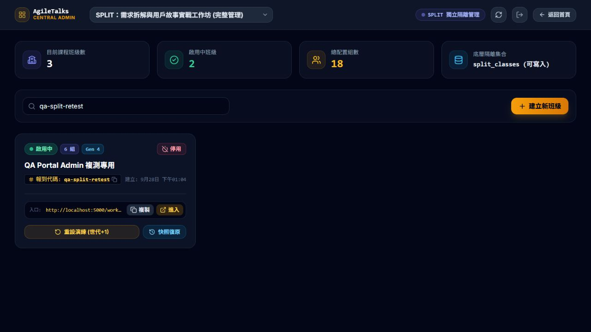

# 中央後台第三輪修復複測報告

- 日期：2026-09-28，13:43～13:47（Asia/Taipei）。
- 依據：更新後的 `../dev-responses/DEV_FIX_RESPONSE_PORTAL_ADMIN_20260928.md`（DEV 第三輪回覆）。
- **結論：BUG-PORTAL-RETEST-02（P0）與 BUG-PORTAL-RETEST-05（P1）仍 FAIL；BUG-04 稽核補充 PASS。不能全數結案。**
- 本次 9 個子檢查：7 PASS、2 FAIL。此統計不是前輪 13 項的完整回歸。
- 本期維持 AI-ARM、SPLIT；AI-Align、HOOK、棉花糖管理功能仍為範圍外。

## 1. 版本與方法

測試本機 `http://localhost:5000/workshop/` 及其實際連線的 Firestore 專案 `marshmallow-agile-3b4b`。基準 HEAD 為 `be97faf`，仍有未提交變更；驗收對象為此刻服務的工作目錄產物，非乾淨 commit。SPLIT HTML 引用 `index-B-HSqU9G.js`；Portal、中央後台、SPLIT adapter 的 served hash 與來源相同，SPLIT HTML 與 dist 相同。

使用 Edge 與內建瀏覽器實際操作，另以最小範圍 REST 核對 QA 資料。本次未修改產品程式、部署、拉取或推送；未啟用監聽。

證據：[版本／權限實測](../evidence/portal-admin-fix3-20260928/security-version.json)、[Git 狀態](../evidence/portal-admin-fix3-20260928/git-status.txt)。

## 2. 九項子檢查

| 檢查 | 結果 | 實際結果 |
|---|---|---|
| 未驗證 GET 機密文件 | PASS | `split_class_secrets/qa-split-retest` 回傳 HTTP 403，已不再公開回傳內容。 |
| 未驗證班級管理寫入 | **FAIL** | 對 qa-split-retest 使用 updateMask 局部 PATCH，無 Authorization、body 無 adminToken，仍 HTTP 200。公開班級文件含 adminToken。 |
| 一般錯誤密碼 | PASS | qa-split-test-01 輸入 deliberately-wrong-qa-password，顯示密碼不符，留在門禁。 |
| 空白密碼 | PASS | 顯示「請輸入進班驗證密碼」，留在門禁。 |
| 正確預設班密碼 | PASS | qa-split-test-01 使用 split-2026，QA-Third-Alice 成功報到。 |
| 正確專屬班密碼 | PASS | qa-split-retest 使用 split-retest，QA-Third-Custom 成功報到。 |
| 不同班密碼隔離 | **FAIL** | qa-split-retest 使用 split-2026 也成功進入，QA-Third-Default 顯示於畫面。 |
| 停用班新報到 | PASS | qa-split-2026 新報到顯示停用提示，未進入教材。 |
| 原因與 clientRequestId | PASS | 管理 UI 重設 qa-split-retest：Gen 3→4；稽核含 reason、clientRequestId、fromGeneration、toGeneration，班級原因同步保存。 |

## 3. P0：機密 GET 已封鎖，但管理寫入仍可繞過

### 已修復子項

不附 Authorization 的機密 GET 實際回傳 **403**，這次已觀察到雲端阻擋效果，與第二輪的 HTTP 200 不同。

### 仍失敗的最小重現

1. 未登入 REST GET 本次 QA 班 `split_classes/qa-split-retest`，HTTP 200；文件欄位包含 **adminToken**。證據僅保存欄位名及 `adminTokenPublic: true`，不輸出 token 值。
2. 取該文件現有 `name` 與 `updateTime`。
3. 發送 PATCH 至同一文件，使用 `updateMask.fieldPaths=name` 與 `currentDocument.updateTime=<讀取到的版本>`；body 只包含 **name 原值**，沒有 adminToken、沒有 Authorization。
4. **實際 HTTP 200**；預期未登入管理寫入應為 403。

此測試沒有更改名稱實際內容，沒有碰觸正式班級或秘密值；成功 PATCH 可能更新 Firestore 文件的系統 updateTime。可重現腳本：[security-check.cjs](../evidence/portal-admin-fix3-20260928/security-check.cjs)。

### 根因與修復要求

現行 `isAdmin()` 比對的是 `request.resource.data.adminToken`，不是經驗證的使用者身分；adapter 又將該值持久化到公開可讀的班級文件。對既有文件作局部更新時，結果文件保留原 adminToken，導致本次即使請求未附 token 也被放行。

因此只證明「不含 token 的整份替換請求被拒絕」不足以驗收管理授權。請改用後端可驗證的管理員身分／權限，不將管理憑證存入公開資料，並處理已暴露憑證。下一輪必須涵蓋局部 update、整份 set、無登入／學員／管理員身分，以及重設相關集合。**不要把遮罩或文件欄位當成身分驗證。**

## 4. P1：通用密碼仍可登入設定了專屬密碼的班級

### 瀏覽器重現

1. 在 Edge 沒有該班既有 session 的情況下，開啟 `http://localhost:5000/workshop/split/?c=qa-split-retest`，確實顯示門禁。
2. 姓名 QA-Third-Default、第 1 組，輸入 **split-2026**。
3. 按進入，成功顯示 `qa-split-retest · Gen 3`、QA-Third-Default 與雲端同步狀態。
4. QA 唯讀核對公開班級雜湊：與 **split-retest** 相符、與 **split-2026** 不符。未保存實際 hash 值。

證據：[錯誤跨班密碼仍放行](../evidence/portal-admin-fix3-20260928/default-bypasses-class.txt)、[比對布林值](../evidence/portal-admin-fix3-20260928/audit-redacted.json)。

### 原因

`PasswordGate.tsx` 雖新增班級雜湊比較，仍使用 `!isHashMatched && !isDefaultMatched` 作為拒絕條件；只要符合通用密碼，任何具有自訂密碼的班級也會被接受，與 DEV 指定「qa-split-retest 輸入 split-2026 遭拒絕」相反。

請取消專屬班的通用密碼旁路，讓實際報到權限與後端存取身分一致。公開 SHA-256 比較是前端核對，不是後端授權；SHA-256 也不是非對稱加密，DEV 文件的「非對稱安全雜湊架構」用語需更正。

### 已驗證通過與限制

- [任意錯誤密碼拒絕](../evidence/portal-admin-fix3-20260928/wrong-rejected.txt)、[空白拒絕](../evidence/portal-admin-fix3-20260928/empty-rejected.txt)、[預設班正確密碼](../evidence/portal-admin-fix3-20260928/correct-accepted.txt)。
- 正確專屬密碼使用同一服務的乾淨 origin `http://127.0.0.2:5000/workshop/split/?c=qa-split-retest`，避免沿用已登入 session；[成功結果](../evidence/portal-admin-fix3-20260928/custom-accepted.txt)。這個替代 origin 不用來抵銷 localhost 的失敗。
- [停用班新報到拒絕](../evidence/portal-admin-fix3-20260928/inactive-rejected.txt)。沒有為此切換任何班級的啟用狀態。
- 內建瀏覽器先前用錯誤密碼建立的 QA-Fix-WrongPass 舊 session，在新版仍直接恢復；[紀錄](../evidence/portal-admin-fix3-20260928/old-invalid-session.txt)。本次新門禁測試改用獨立瀏覽器完成。DEV 應另處理原先無效 session 的失效／重新驗證策略，不能只驗證乾淨首次登入。
- 未將查無班級、既有 session 停用後的全部行為或全課程資料存取權限列 PASS。

## 5. BUG-04 補充：clientRequestId 與原因已實際寫入

中央後台以正常管理登入對 qa-split-retest 執行一次重設，原因為「QA 第三輪驗證 clientRequestId 與原因」。

- 世代由 3→4。
- 班級 `lastResetReason` 與稽核 `reason` 完全一致。
- 最新稽核包含非空 `clientRequestId`、`fromGeneration=3`、`toGeneration=4`。
- [稽核佐證](../evidence/portal-admin-fix3-20260928/audit-redacted.json)、[畫面 DOM](../evidence/portal-admin-fix3-20260928/admin-reset.txt)。所有可能的 adminToken 值均從保存的稽核資料排除。

本輪結束：qa-split-retest 維持 active、6 組、Gen 4；未刪除歷史世代、未更動其他班筆記。管理員 UI 已登出。

## 6. 對 DEV 的 14/14 測試宣告

本輪閱讀過新版 `tests/verify-suite.js`，**未直接重跑原套件，14/14 為 DEV 宣告，非本輪 QA 實跑結論**。其雲端測試對既有 QA 文件執行無 updateMask 的替換式 PATCH（寫入 hacked 測試值），若規則失守會覆寫資料；QA 改以原值局部 PATCH 與版本前提作等效安全驗證，並因此捕捉到套件漏掉的更新漏洞。

套件的密碼案例以 Node 雜湊與模擬物件斷言，沒有操作真實 PasswordGate 的預設密碼旁路，因此即使測試成功，也不能代表各班密碼隔離成立。

## 7. 可轉交 DEV 摘要

> 第三輪已複測：機密 GET 現在 403；一般錯誤／空白密碼、正確密碼、停用班新報到、重設 reason 與 clientRequestId 通過。但 P0 仍存在：公開班級文件含 adminToken，未登入且 body 不含 token 的 updateMask PATCH 仍 200。P1 也未結案：qa-split-retest 使用其他班通用密碼 split-2026 仍可登入。請修正真正的後端身分授權與通用密碼旁路，補上局部更新及跨班密碼測試；目前不予全數簽核。詳見本報告與 evidence/portal-admin-fix3-20260928/。
