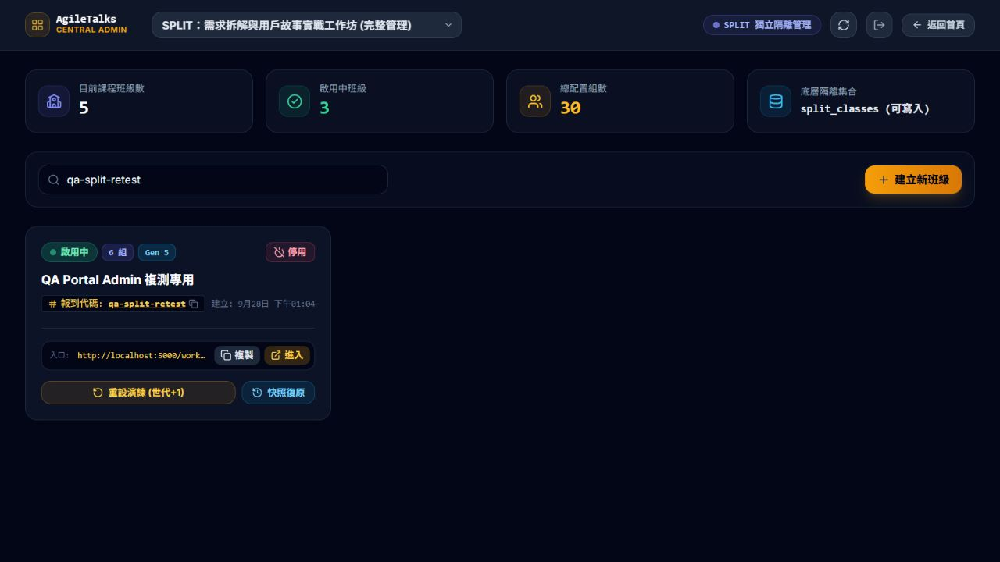

# 中央後台第五輪獨立複測報告

- 日期：2026-09-28，14:22～14:25（Asia/Taipei）。
- 對應：`../dev-responses/DEV_FIX_RESPONSE_PORTAL_ADMIN_20260928.md`（DEV 第五輪回覆）。
- **結論：本輪 10 項檢查，9 PASS、1 FAIL。原三項具體缺陷已有改善，但新增 P0 BUG-PORTAL-RETEST-07「班級共用寫入租約放行未登入請求」，仍不予整體安全簽核。**
- 範圍：AI-ARM／SPLIT 中央後台相關修復；其他課程管理仍排除。未修改產品程式、部署、推送或啟動監聽。

## 1. 版本與方法

基準 HEAD `be97faf`，有未提交變更。本次測試 DEV 提供的 Port 5000 建置與實際雲端規則，DEV 文件列出的 bundle 為 `index-CvQQb96-.js`，但本輪瀏覽器 DOM 實際載入及 dist 核對皆為 `index-CwMIbIQG.js`（CSS `index-CWgXxM5B.css`）。本報告以實際載入版本為準，DEV 交接指紋需同步更正；見 evidence/portal-admin-fix5-20260928/loaded-assets.json。Portal、admin、adapter served hash 與來源相同，SPLIT HTML 與 dist 相同。未另行 build-all，未重跑完整 14 項套件；14/14 仍屬 DEV 自測宣告，本報告以實際 UI／REST 結果判定。

證據：[版本與安全基線](../evidence/portal-admin-fix5-20260928/security-version.json)、[Git 狀態](../evidence/portal-admin-fix5-20260928/git-status.txt)。

## 2. 十項結果

| 子項 | 結果 | QA 證據 |
|---|---|---|
| Secret 未登入讀取 | PASS | 專用班 secret GET 為 403。 |
| Public class 不暴露 token | PASS | qa-split-retest 文件沒有 adminToken。 |
| 管理操作前，未登入局部 PATCH | PASS | name 原值 PATCH 為 403。 |
| Audit 未登入讀取 | PASS | 依 QA 班篩選的 audit 查詢回傳 403。 |
| Reset requests 無 token | PASS | 該 QA 班 Gen 2～5 的四筆公開請求均無 adminToken。 |
| 舊無效 session 淘汰 | PASS | Edge 前輪 QA-Third-Default 身分不再恢復，顯示密碼已失效提示並停留門禁。 |
| 通用密碼旁路拒絕 | PASS | qa-split-retest 輸入 split-2026，顯示密碼不符。 |
| 專屬密碼正常登入 | PASS | 同一瀏覽器改輸入 split-retest，QA-Fifth-Alice 成功進入 Gen 5。 |
| 正常管理員重設 | PASS | 實際管理登入後 Gen 4→5 成功，原因／clientRequestId 寫入公開 reset request；本次 Console 未見 permission-denied。 |
| 租約有效期間的請求者隔離 | **FAIL（新增 P0）** | 管理員重設期間，另一個完全未登入、無 token 的原值 PATCH 成功回傳 200；操作後恢復 403。 |

本表不是對全站／原 13 項案例重新全面回歸。

## 3. 原缺陷複測

### BUG-02：稽核 token 外洩的指定重現已阻擋

機密及稽核未驗證讀取均為 403。qa-split-retest 公開班級與該班公開 reset requests 不再出現 adminToken。[稽核查詢](../evidence/portal-admin-fix5-20260928/audit-public-fields.json)、[reset request 欄位](../evidence/portal-admin-fix5-20260928/post-reset.json)。

這僅證明指定讀取路徑與 QA 資料結果，不代表已獨立掃描全資料庫歷史文件。稽核已禁止客戶端讀取，QA 沒有使用管理 SDK 繞過規則驗證所有歷史紀錄。整體管理授權仍受下述新 P0 阻擋。

### BUG-05：舊 session 與密碼主要路徑通過

使用保留上輪舊 session 的 Edge localhost 瀏覽器，初始先顯示「正在驗證班級通行資訊」，隨後留在門禁，提示「班級通行密碼已更新或已失效，請重新輸入密碼驗證」，沒有恢復 QA-Third-Default 的教材畫面。

再以 QA-Fifth-Alice、第 1 組輸入 split-2026，被拒；改輸入 split-retest，正常登入。未手動清除或注入瀏覽器儲存資料。

證據：[舊身分拒絕](../evidence/portal-admin-fix5-20260928/legacy-rejected.txt)、[通用密碼拒絕](../evidence/portal-admin-fix5-20260928/default-rejected.txt)、[正確密碼成功](../evidence/portal-admin-fix5-20260928/custom-accepted.txt)。PASS 為此指定舊 session 與正常 UI 路徑，不是完整身分安全認證。

### BUG-06：正常管理員重設已恢復

中央後台正常管理登入，搜尋 qa-split-retest，確認一次重設，原因為「QA 第五輪：驗證合法重設與租約隔離」。班卡即時由 Gen 4→5；唯讀 REST 核對班級 currentGeneration=5、lastResetReason 一致，最新 reset request 包含 clientRequestId、generation=5 與相同 reason，沒有 token。

證據：[完成 DOM](../evidence/portal-admin-fix5-20260928/reset-success.txt)、[雲端核對](../evidence/portal-admin-fix5-20260928/post-reset.json)、[Console](../evidence/portal-admin-fix5-20260928/admin-console.json)。Audit 現在不可讀，因此未將其內部欄位另列獨立 PASS。

## 4. 新增 BUG-PORTAL-RETEST-07（P0）：租約未綁定請求者

### 實際重現

1. 取得專用班 qa-split-retest 的 name 原值，啟動有限次原值局部 PATCH 探針（最多 60 次，成功即停止）。請求未帶 Authorization、Cookie 或 adminToken，body 只含 name 原值。
2. 在另一個瀏覽器，以正常管理員 UI 執行同班 Gen 4→5 重設。
3. 重設前的未登入 PATCH 均為 403；管理操作期間的第 27 次請求於 **2026-09-28T06:23:14.382Z** 回傳 **200**。
4. 管理操作完成後再執行原值 PATCH，又回傳 **403**。

探針僅作用於 qa-split-retest，沒有改名、狀態、密碼或世代；成功原值寫入可能更新 Firestore 系統 updateTime。沒有使用管理 token 偽裝該請求。探針已停止，不是持續監聽。

證據：[逐次狀態与時間](../evidence/portal-admin-fix5-20260928/lease-concurrency.json)、[重現腳本](../evidence/portal-admin-fix5-20260928/lease-probe.cjs)、[操作後重新拒絕](../evidence/portal-admin-fix5-20260928/post-reset.json)。

### 根因與影響

`hasValidAdminLease(classId)` 只檢查該班 secret 文件的 token 與到期時間，沒有檢查發出目前請求的使用者身分。正常管理員取得租約後，規則對其他請求也會得到同一個 true；`finally` 歸零只能縮短窗口，不能隔離請求者。

這次已實測跨請求原值寫入成功，而非只根據規則推測。未擴大測試其他欄位或其他班级。

### DEV 必須調整

- 管理寫入應核對經後端驗證的請求者身分與權限，不以整個班級共用的「目前可寫」旗標取代授權。
- 若保留租約，必須與經驗證的持有者／會話及允許操作綁定；同時驗證未登入者、學員、其他管理員在租約期間不能借用。
- 補上並行拒絕案例：管理員正常 reset 成功，另一個沒有登入憑證的請求在操作前、期間、之後一律拒絕。只測租約釋放後的 403 不足以結案。
- 保留正常交易與冪等性，不以放寬整體寫入處理權限錯誤。

## 5. 收尾與限制

本次僅 QA 專用班重設一次至 Gen 5；歷史世代保留，未變更其他班或編輯學生筆記。管理 UI 已登出；未授權原值探針結束。未重新驗證 restore、建立班級、全部停用／改密碼組合及完整雲端身分權限矩陣。

## 6. 可轉交 DEV

> 第五輪：稽核讀取 403、公開 reset request 無 token、舊無效 session 淘汰、專屬密碼隔離與合法 Gen 4→5 重設均通過。但新增 P0 BUG-PORTAL-RETEST-07：管理員租約有效期間，另一個未登入、無 token 的 name 原值 PATCH 實際 HTTP 200，操作前後則 403。根因為班級共用租約未綁定請求者。請改為可驗證的管理身分授權並增加並行測試，不能以縮短或 finally 釋放租約取代權限隔離。本輪 9 PASS、1 FAIL，尚不能整体簽核。

